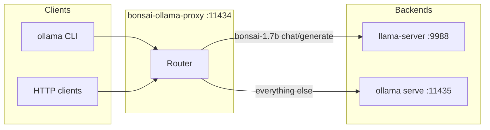

# bonsai-ollama

[](LICENSE)
[](https://go.dev/dl/)

**Run [PrismML Bonsai 1.7B](https://huggingface.co/prism-ml/Bonsai-1.7B-gguf) (GGUF `Q1_0`) with the [Ollama](https://ollama.com) CLI and HTTP API** even though the stock Ollama engine cannot load this quantization yet. This repository ships a small **Go reverse proxy** that forwards Bonsai traffic to [PrismML’s `llama-server`](https://github.com/PrismML-Eng/llama.cpp/releases) and everything else to a normal `ollama serve`.

**Upstream weights & paper trail:** [Hugging Face — `prism-ml/Bonsai-1.7B-gguf`](https://huggingface.co/prism-ml/Bonsai-1.7B-gguf) (Apache-2.0) · [Bonsai-demo](https://github.com/PrismML-Eng/Bonsai-demo) · [Ollama import docs](https://docs.ollama.com/import)

**Registry (same GGUF; still needs this proxy until Ollama supports `Q1_0`):** [ollama.com/eslider/bonsai-1.7b](https://ollama.com/eslider/bonsai-1.7b)

---

## Table of contents

- [Why this exists](#why-this-exists)
- [How it works](#how-it-works)
- [Quick start](#quick-start)
- [Full setup](#full-setup)
- [Daily use](#daily-use)
- [HTTP API examples](#http-api-examples)
- [Streaming](#streaming)
- [Configuration](#configuration)
- [Troubleshooting](#troubleshooting)
- [Repository layout](#repository-layout)
- [Contributing](#contributing)
- [License](#license)

---

## Why this exists

Bonsai ships in **GGML `Q1_0`** (1-bit, g128 scales). Ollama’s bundled [`ggml`](https://github.com/ollama/ollama) build currently ends its type enum **before** `Q1_0`, so the runner fails while loading tensors (`model failed to load` / HTTP **500**). That is a **missing tensor type in Ollama**, not an out-of-memory error.

PrismML’s **`llama-server`** builds include the kernels this GGUF needs. This project sits **in front of** Ollama: it runs `llama-server` locally and **translates** OpenAI-style [SSE streaming](https://developer.mozilla.org/en-US/docs/Web/API/Server-sent_events/Using_server-sent_events) from Prism into [Ollama’s streaming JSON API](https://docs.ollama.com/api) for Bonsai, while **reverse-proxying** all other routes to your existing Ollama daemon.

---

## How it works



| Port | Process | Role |
|------|---------|------|
| **11434** | `bonsai-ollama-proxy` | What you point `OLLAMA_HOST` at |
| **11435** | `ollama serve` | Normal models, `ollama pull`, etc. |
| **9988** | `llama-server` | Loads `Bonsai-1.7B-Q1_0.gguf`, OpenAI-compatible `/v1/chat/completions` |

---

## Quick start

```bash
git clone https://github.com/eSlider/bonsai-ollama.git
cd bonsai-ollama

# Download GGUF + Prism Ubuntu x64 binaries (see [Full setup](#full-setup))
# …

./bin/run.sh   # builds proxy if needed, frees 11434/11435/9988, starts stack

export OLLAMA_HOST=http://127.0.0.1:11434
ollama run eslider/bonsai-1.7b "Say hello in one sentence."
```

---

## Full setup

### Prerequisites

| Requirement | Notes |
|---------------|--------|
| [Go](https://go.dev/dl/) **1.22+** | Build `bonsai-ollama-proxy` |
| [Ollama](https://ollama.com/download) | Backend on port `11435` |
| `fuser` (optional) | From [`psmisc`](https://gitlab.com/psmisc/psmisc) on Debian/Ubuntu — `scripts/bonsai-ollama-stack.sh` uses it to free ports |

### 1. Download the GGUF (~237 MiB)

Official file: [`Bonsai-1.7B-Q1_0.gguf`](https://huggingface.co/prism-ml/Bonsai-1.7B-gguf/blob/main/Bonsai-1.7B-Q1_0.gguf)

```bash
mkdir -p models/bonsai-1.7b
curl -fL -o models/bonsai-1.7b/Bonsai-1.7B-Q1_0.gguf \
  "https://huggingface.co/prism-ml/Bonsai-1.7B-gguf/resolve/main/Bonsai-1.7B-Q1_0.gguf"
```

### 2. Download Prism `llama-server` (Ubuntu x64 CPU)

Release asset (pinned version in this repo): [`llama-prism-b8846-d104cf1-bin-ubuntu-x64.tar.gz`](https://github.com/PrismML-Eng/llama.cpp/releases/download/prism-b8846-d104cf1/llama-prism-b8846-d104cf1-bin-ubuntu-x64.tar.gz)

```bash
mkdir -p vendor/prism-llama && cd vendor/prism-llama
curl -fL -o prism.tar.gz \
  "https://github.com/PrismML-Eng/llama.cpp/releases/download/prism-b8846-d104cf1/llama-prism-b8846-d104cf1-bin-ubuntu-x64.tar.gz"
tar -xzf prism.tar.gz
cd ../..
```

Other platforms (**CUDA**, **Vulkan**, **macOS**, etc.) are on the [PrismML-Eng/llama.cpp releases](https://github.com/PrismML-Eng/llama.cpp/releases) page. Extract into `vendor/prism-llama/` and set `BONSAI_PRISM_LIB_DIR` to the folder that contains `llama-server` and its `.so` / `.dylib` files.

### 3. Build the proxy

```bash
cd cmd/bonsai-ollama-proxy
go build -o ../../bin/bonsai-ollama-proxy .
```

### 4. Run the stack

Stop anything already bound to **11434**, **11435**, and **9988** (or let the script try `fuser -k`).

```bash
./bin/run.sh
```

- Builds `bin/bonsai-ollama-proxy` if missing, then runs `scripts/bonsai-ollama-stack.sh`.
- Backend logs: `/tmp/ollama-bonsai-backend.log`.

---

## Daily use

Point every Ollama client at the **proxy** (not the backend port):

```bash
export OLLAMA_HOST=http://127.0.0.1:11434
ollama list
ollama run eslider/bonsai-1.7b "Your prompt"
ollama run qwen3:4b "Other models still go to backend :11435"
```

`OLLAMA_HOST` is documented in the [Ollama FAQ / Linux](https://github.com/ollama/ollama/blob/main/docs/faq.md).

---

## HTTP API examples

**Chat (non-stream):**

```bash
curl -sS http://127.0.0.1:11434/api/chat \
  -H "Content-Type: application/json" \
  -d '{"model":"eslider/bonsai-1.7b","messages":[{"role":"user","content":"Hi"}],"stream":false}'
```

**Generate (non-stream):**

```bash
curl -sS http://127.0.0.1:11434/api/generate \
  -H "Content-Type: application/json" \
  -d '{"model":"eslider/bonsai-1.7b","prompt":"Hello","stream":false}'
```

---

## Streaming

For each `data:` line from `llama-server`’s OpenAI SSE stream, the proxy emits **one Ollama NDJSON object** with that text delta and **`Flush`es immediately**, so backend token granularity is preserved.

```bash
curl -sS -N -X POST http://127.0.0.1:11434/api/chat \
  -H "Content-Type: application/json" \
  -d '{"model":"eslider/bonsai-1.7b","messages":[{"role":"user","content":"Count 1 2 3"}],"stream":true}' \
| python3 scripts/verify_stream.py
```

[`scripts/verify_stream.py`](scripts/verify_stream.py) checks that chunks arrive and that there are no multi-second stalls.

---

## Configuration

Environment variables (optional). Full notes: [`models/bonsai-1.7b/OLLAMA.txt`](models/bonsai-1.7b/OLLAMA.txt).

| Variable | Default | Meaning |
|----------|---------|---------|
| `BONSAI_REPO_ROOT` | parent of proxy binary `../..` | Root for default GGUF / Prism paths |
| `BONSAI_GGUF` | `models/bonsai-1.7b/Bonsai-1.7B-Q1_0.gguf` under root | Path to GGUF |
| `BONSAI_PRISM_LIB_DIR` | `vendor/prism-llama/llama-prism-b8846-d104cf1` under root | Directory with `llama-server` + libs |
| `BONSAI_PROXY_LISTEN` | `127.0.0.1:11434` | Proxy listen address |
| `BONSAI_OLLAMA_BACKEND` | `http://127.0.0.1:11435` | Upstream Ollama |
| `BONSAI_LLAMA_PORT` | `9988` | `llama-server` port |
| `OLLAMA_BIN` | `/usr/local/bin/ollama` | Used by `bonsai-ollama-stack.sh` only |

---

## Troubleshooting

| Symptom | What to check |
|---------|----------------|
| **Address already in use** | Free `11434` / `11435` / `9988` or change ports via env vars. |
| **`llama-server` not found** | `BONSAI_PRISM_LIB_DIR` must contain the extracted Prism binaries. |
| **GGUF not found** | `BONSAI_GGUF` path; run the [download curl](#1-download-the-gguf-237-mib). |
| **`ollama run` hangs in CI** | Use a real TTY or call `/api/chat` with `curl` / your HTTP client. |
| **Stock Ollama still 500 on Bonsai** | You must talk to the **proxy** (`OLLAMA_HOST=…:11434`), not raw `:11435`. |

---

## Repository layout

| Path | Purpose |
|------|---------|
| [`cmd/bonsai-ollama-proxy/`](cmd/bonsai-ollama-proxy/) | Go source: proxy + `llama-server` supervisor |
| [`scripts/bonsai-ollama-stack.sh`](scripts/bonsai-ollama-stack.sh) | Starts backend Ollama + proxy |
| [`scripts/verify_stream.py`](scripts/verify_stream.py) | Quick streaming sanity check |
| [`bin/run.sh`](bin/run.sh) | Build-if-needed + exec stack |
| [`models/bonsai-1.7b/Modelfile`](models/bonsai-1.7b/Modelfile) | `ollama create` recipe (weights not in git) |
| [`models/bonsai-1.7b/OLLAMA.txt`](models/bonsai-1.7b/OLLAMA.txt) | Extra operational notes |

---

## Importing without the proxy (expect failure on `run`)

From `models/bonsai-1.7b/`:

```bash
ollama create bonsai-1.7b -f Modelfile
```

This registers the blob, but **`ollama run` keeps failing** until Ollama ships `Q1_0` support. Use the proxy stack for inference today.

---

## Optional: run Prism only

```bash
cd vendor/prism-llama/llama-prism-b8846-d104cf1
LD_LIBRARY_PATH="$PWD" ./llama-server \
  -m ../../../models/bonsai-1.7b/Bonsai-1.7B-Q1_0.gguf \
  --host 127.0.0.1 --port 9988
```

Then use OpenAI-compatible [`POST /v1/chat/completions`](https://platform.openai.com/docs/api-reference/chat/create). See [Bonsai-demo](https://github.com/PrismML-Eng/Bonsai-demo) for more integration examples.

---

## Contributing

Issues and PRs are welcome. When changing the proxy, run:

```bash
cd cmd/bonsai-ollama-proxy && go vet ./... && go test ./...
```

(`go test` is a no-op until tests exist; `go vet` should be clean.)

---

## License

- **This repository** (Go proxy, scripts, docs): [MIT](LICENSE).
- **Bonsai weights & Prism upstream**: [Apache-2.0](https://huggingface.co/prism-ml/Bonsai-1.7B-gguf) on Hugging Face; follow their attribution and license terms when redistributing GGUF files.
